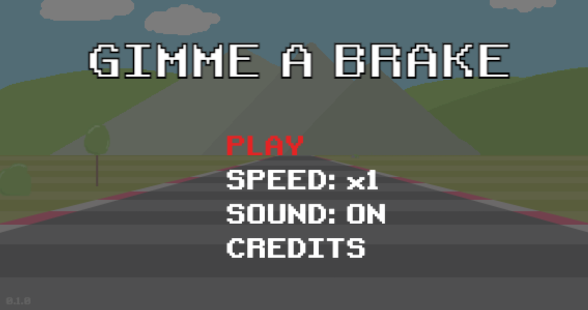
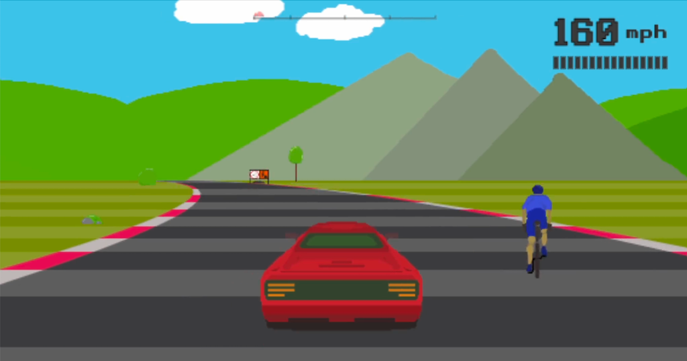
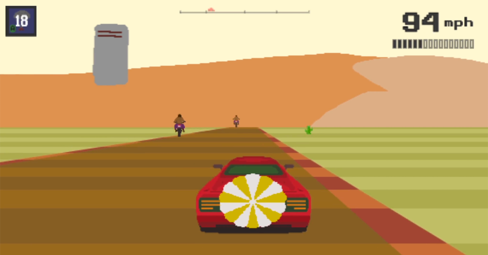
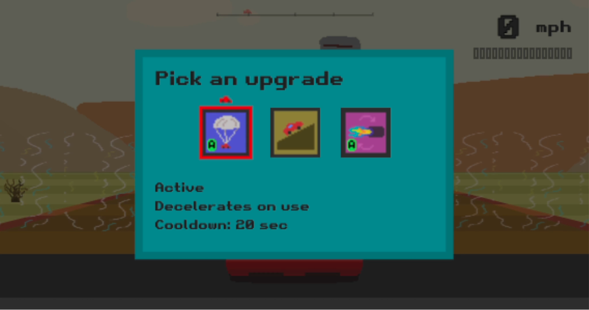
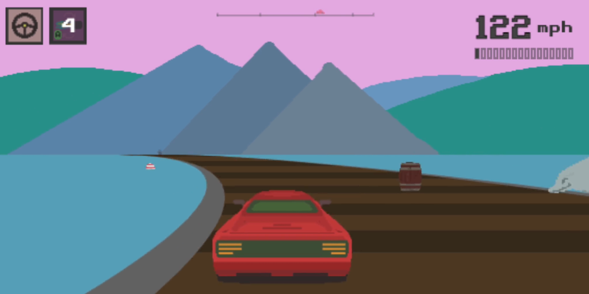
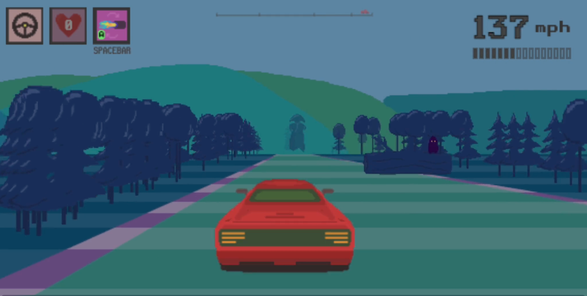

# Gimme a brake

### [Play the game](https://dogballs.github.io/gimme-a-brake/)

Note: mobile not supported

### About

2.5d racing game made for a [Game Off Jam 2022](https://itch.io/jam/game-off-2022).

Inspired by Outrun that I used to play as a kid on arcade machines and Horizon Chase Turbo that I played recently.

The idea of making a 2.5d game came after reading a [Wolfenstein 3d Game Engine Black Book](https://fabiensanglard.net/gebbwolf3d/) that I highly recommend.

Written in TypeScript and utilizing HTML canvas without using any third-party libs.

TODO: itch.io page

### Screenshots

| Screenshots                                       |                                             |
|---------------------------------------------------|---------------------------------------------|
|        |    |
|  |  |
|          |  |
